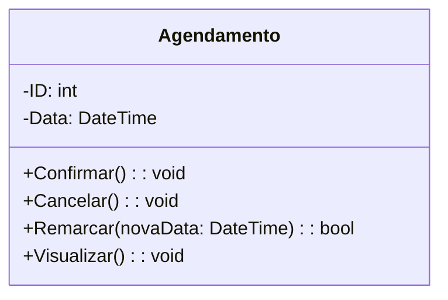

```mermaid
        classDiagram
    class Agendamento {
        -ID: int
        -Data: DateTime
        +Confirmar (): void
        +Cancelar (): void
        +Remarcar (novaData: DateTime): bool
        +Visualizar (): void
    }
```