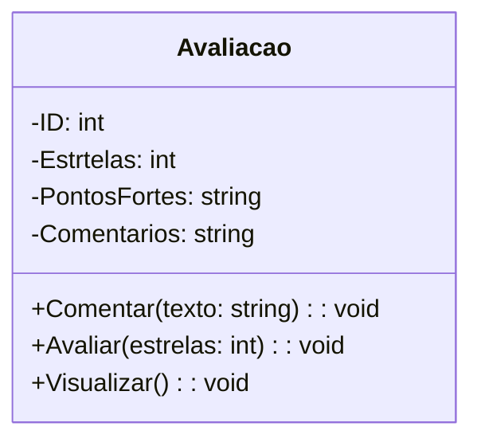

```mermaid
        classDiagram
    class Avaliacao {
        -ID: int 
        -Estrtelas: int
        -PontosFortes: string
        -Comentarios: string
        +Comentar(texto: string): void
        +Avaliar(estrelas: int): void
        +Visualizar (): void
    }
```