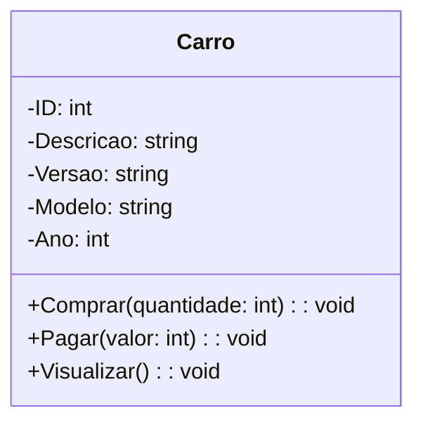

```mermaid
        classDiagram
    class Carro {
        -ID: int
        -Descricao: string
        -Versao: string
        -Modelo: string
        -Ano: int
        +Comprar(quantidade: int): void
        +Pagar(valor: int): void
        +Visualizar (): void
    }
```