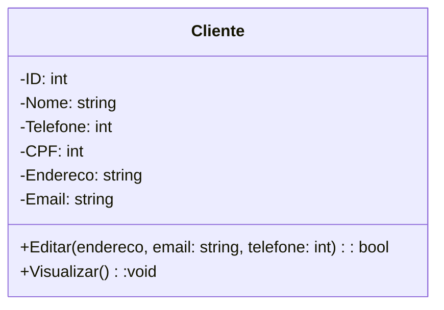

```mermaid
        classDiagram
    class Cliente {
        -ID: int
        -Nome: string
        -Telefone: int
        -CPF: int
        -Endereco: string
        -Email: string        
        +Editar(endereco, email: string, telefone: int): bool
        +Visualizar ():void 
    }
```