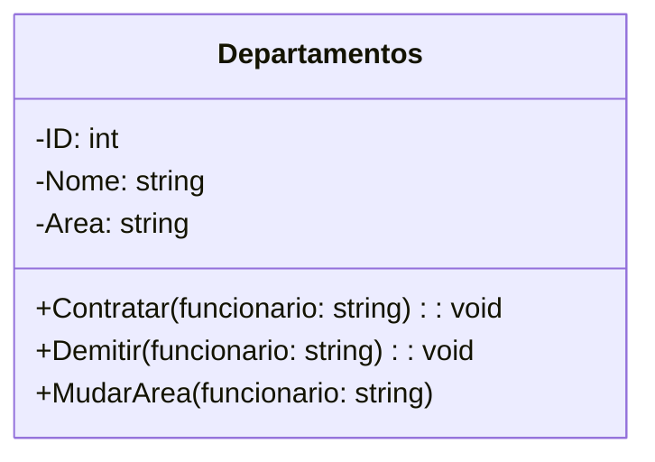

```mermaid
        classDiagram
    class Departamentos {
        -ID: int
        -Nome: string
        -Area: string
        +Contratar (funcionario: string): void
        +Demitir (funcionario: string): void
        +MudarArea (funcionario: string)
    }
```