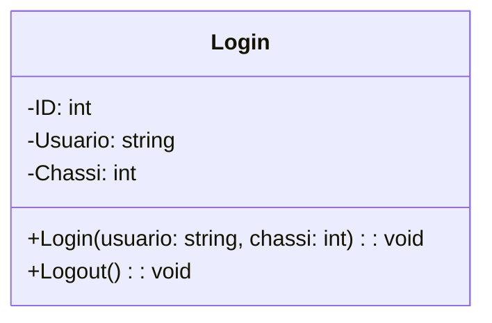

```mermaid
        classDiagram
    class Login {
        -ID: int
        -Usuario: string
        -Chassi: int
        +Login(usuario: string, chassi: int): void
        +Logout (): void
    }
```